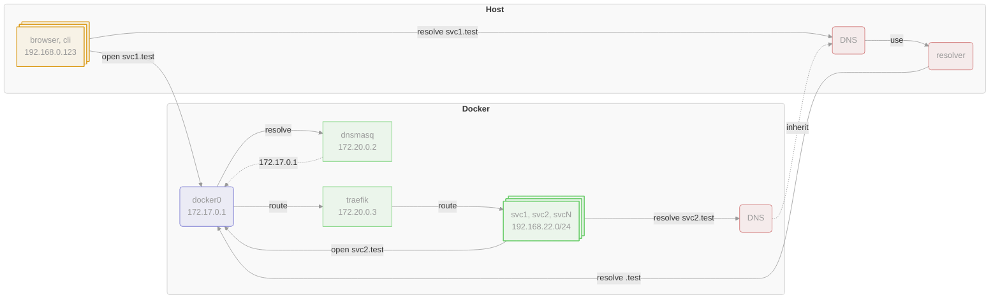

# .local.test

**Objective:** Enhance developer experience (DX) with a streamlined `docker compose` stack that offers `.test` TLD support,
local DNS, TLS encryption, load-balancer with auto-wired routing, and offline capability without the overhead of complex orchestration platforms.

**Status:** In active development

**Rationale:**

> Back in November 2017, I ran into a common challenge: how to make my local development environment behave
> like production with encryption-in-transit and FQDN supports.
> At the time, I was working on two projects, and managing multiple localhost ports was a pain—eventually
> causing collisions on the desired ports. Still, it was functional.
>
> Later, my focus moved to cloud infrastructure, and this issue faded into the background — until recently.
>
> By Christmas 2024, I had returned to local web development, only to find that the old approach was no longer sufficient.
>
> I'm not big fan of kubernetes, and after a period of research and testing, I eventually developed an approach to meet
> my needs using a set of open-source tools that felt both stable and practical.
>
> -- <cite>Nikolai Zujev</cite>

**List of features:**
- OS-agnostic (Linux/macOS) developer experience
- reserved [.test](https://en.wikipedia.org/wiki/.test) TLD support
- seamless routing on **host** and in **containers** using `.test` FQDNs
- private **DNS nameserver** by `dnsmasq` to minimize network hops
- full **offline** support, except for the initial build and run
- layer 4 and 7 **load-balancer** with **TLS termination** by `traefik`
- automated TLS certificate generation with `mkcert`
- flexible UI to manage `docker` resources by `portainer`
- auto-wire of separate application stacks using `traefik` labels
- various examples and more ...

> This project was partially inspired by [devspace](https://devspace.sh) (K8s-based) and `localtest.me` (needs connection to resolve 127.0.0.1).



Such setup enhances security by limiting internal resources exposure while enabling seamless FQDN resolution from the
host and from the container, ensuring efficient and secure communication, that can work with disconnected network.

**Tested on:**

  - **Linux**: Debian (11/12), Ubuntu (24), Fedora (38/40)
  - **macOS**: Rancher Desktop (qemu/vz), colima (qemu/vz)


## Usage

**Prerequisites:**

- `docker` server is up and running
- `docker compose` plugin is installed
- `mkcert` binary is installed

Step-by-step configuration:

1. prepare Root CA certificate:

    Create and trust `mkcert`-managed CA by **host** trusted stores:

    > **NOTE:** It will ask several times for your password (in CLI and GUI), as it uses `sudo`.

    ```console
    $ mkcert -install
    ```

    Copy (symlink not accessible from container) **host Root CA** and adjust permissions:

    ```console
    $ cp "$(mkcert -CAROOT)"/rootCA*.pem certs/
    $ chmod 0400 certs/rootCA*.pem
    ```

    > **NOTE:** fix `permission denied` error by adjusting permissions `chmod +w certs/rootCA*.pem` command.

    **Alternative setup:**

    It's possible to reuse custom **Root CA** from `./certs` directory. However, these **Root CA** must be re-trusted once they've changed.

    ```console
    $ CAROOT=./certs mkcert -install
    ```

1. build and start `docker compose` stack:

    ```console
    $ docker compose build

    $ docker compose up --wait
    ```

1. tail `docker compose` logs for observability _(best in other terminal window/tab)_:

    ```console
    $ docker compose logs -f
    ```

1. setup **host** system: _(once per setup)_

    - configure [Linux](#setup-linux) host
    - configure [macOS](#setup-macos) host
    - run [setup validation](#setup-validation)
    - check [troubleshooting](#setup-troubleshooting) if needed

1. visit http://local.test to kickstart your developer experience

    Explore [examples/](./examples/) code to get inspiration for customization.

1. celebrate, share your experience and report findings


## Setup

By default, exposed ports of the `dnsmasq` and `traefik` containers are bound to the `172.17.0.1` IP address,
which corresponds to the `docker0` interface on Linux. Therefore code snippets below will use it by default.

Detect configured default docker IP:

```console
$ docker network inspect bridge --format='{{(index .IPAM.Config 0).Gateway}}'
172.17.0.1
```

**Host OS** uses custom DNS resolver to send traffic to `172.17.0.1` IP to resolve `*.test` host names using nameserver running in docker.

> **NOTE:** If IP does not match - use [configuration override](#setup-configuration-override) approach, to tune setup.

### Setup: configuration override

Certain properties could be overridden using `.env` file.

Inspect [.env.dist](.env.dist) file for possible override properties.

1. make a copy of `.env.dist` file:

    ```console
    $ cp .env.dist .env
    ```

    > **NOTE:** file `.env` **MUST** be git-ignored

1. uncomment and adjust envvars to your needs

1. recreate `docker compose` stack

    ```console
    $ docker compose down
    $ docker composer up --wait --build
    ```
---

### Setup: Linux

Running `docker` on **Linux** is native, and requires minimal **host** adjustments:

1. setup [DNS resolver](#setup-linux--dns-resolver)


#### Setup: Linux / DNS resolver

> **NOTE**: `systemd-resolved` is listening on `127.0.0.53:53` address by default, so no conflict expected.

Step-by-step configuration:

1. update `systemd-resolved` to forward `.test` requests directly to `172.17.0.1`:

    ```console
    $ sudo mkdir -p /etc/systemd/resolved.conf.d

    $ cat <<EOF | sudo tee /etc/systemd/resolved.conf.d/test.conf
    [Resolve]
    DNS=172.17.0.1
    Domains=~test
    EOF
    ```

1. enable and restart `systemd-resolved` service:

    ```console
    $ sudo systemctl enable systemd-resolved
    $ sudo systemctl restart systemd-resolved
    $ sudo systemctl status systemd-resolved
    ```

1. let `systemd-resolve` to manage `/etc/resolv.conf`:

    ```console
    $ sudo ln -snf /run/systemd/resolve/stub-resolv.conf /etc/resolv.conf
    ```

---

### Setup: macOS

Running `docker` on **macOS** relies on an intermediate **docker VM** and a bit advanced **host** adjustments.

**macOS** constraints for `docker`:
- there is no `docker0` network interface
- no route to `172.17.0.1` IP address by default
- once network is disconnected or switched off, non-localhost DNS traffic is denied
- prefer using `vz` virtualization with `virtiofs` and `rosetta` options for **docker VM** running on **Apple Silicon**
- network alias, such as `ifconfig lo0 alias 10.254.254.254` is error prone and should not be used
- **docker VM** is managed by one of:

  - [Docker Desktop](https://www.docker.com/products/docker-desktop/)
    - not yet fully tested

  - [Rancher Desktop](https://docs.rancherdesktop.io)
    - **vz** [rootless, privileged]: OK
    - **qemu** [rootless]: OK
    - **qemu** [privileged]: OK

    > **NOTE:** `privileged` consumes extra IP from the router, while `rootless` uses NAT

  - [colima](https://github.com/abiosoft/colima)
    - **qemu** [rootless]: OK
    - **vz** [rootless]: OK

    > **NOTE:** run only ONE **docker VM** to avoid unexpected networking issues.

Required **macOS** host adjustments:

1. setup [DNS resolver and proxy](#setup-macos--dns-resolver-and-proxy)
1. setup [docker routing](#setup-macos--docker-routing)
1. bundle [Root CA certificate](#setup-macos--root-ca-certificate)

---

#### Setup: macOS / DNS resolver and proxy

> **NOTE**: due to **macOS** network behavior, it's highly recommended to use localhost DNS proxy.
If network is disconnected or disabled, **macOS** denies non-localhost DNS traffic.
Just imagine, you're on the plane w/o internet and `.test` domains stops to work.

Step-by-step configuration:

1. update system resolver to forward `.test` requests to `localhost`:

    ```console
    $ sudo mkdir -p /etc/resolver
    $ echo 'nameserver 127.0.0.1' | sudo tee /etc/resolver/test
    ```

1. install `dnsmasq` package to act as DNS proxy:

    ```console
    $ brew install dnsmasq
    ```

1. update `dnsmasq` config to forward requests to **upsteam** DNS in **docker**:

    ```console
    $ cat <<EOF | tee "$(brew --prefix)/etc/dnsmasq.d/proxy.conf"
    listen-address=127.0.0.1
    server=/.test/172.17.0.1
    EOF

    $ dnsmasq --test
    ```

1. restart DNS proxy server and reset cache:

    ```console
    $ sudo brew services restart dnsmasq
    $ sudo killall -HUP mDNSResponder
    ```

1. verify DNS resolver is registered:

    > **NOTE:** `.test` FQDNs won't be resolved unless routing setup is completed.

    ```shell
    $ scutil --dns | grep -A4 -B1 test
    ```

---


#### Setup: macOS / docker routing

This method uses [chipmk/docker-mac-net-connect](https://github.com/chipmk/docker-mac-net-connect/) binary
to create a tunnel to **docker VM** and automatically manage routing rules to **docker** subnets.

For more details please refer to the original documentation.

**Pros:**
- provides auto-discovery for docker subnets
- automated routing management
- **docker VM** might not have dedicated routable IP
- `homebrew` provides default service to auto-start
- good for dynamic/experimental setup
- no overrides by default

**Cons:**
- might have collision on `10.33.33.1` IP with VPN, it's used for tunnel interface
- uses privileged docker socket `/var/run/docker.sock` by default
    - if it's missing, rootless socket (eg. `~/.colima/docker.sock`) have be symlinked manually

Step-by-step configuration:

1. install `docker-mac-net-connect` binary:

    ```console
    $ brew install chipmk/tap/docker-mac-net-connect
    ```

1. verify privileged docker socket exists:

    ```console
    $ ls -l /var/run/docker.sock
    /var/run/docker.sock -> /Users/nzujev/.colima/docker.sock
    ```

    Fix `No such file or directory` error or wrong target with:

    ```console
        - either for Rancher Desktop -

    $ sudo ln -nfs ~/.rd/docker.sock /var/run/docker.sock

        - or for colima with 'default' profile -

    $ sudo ln -nfs ~/.colima/docker.sock /var/run/docker.sock

        - or for colima with 'NAME' profile -

    $ sudo ln -nfs ~/.colima/NAME/docker.sock /var/run/docker.sock
    ```

1. start `docker-mac-net-connect` service:

    ```console
    $ sudo brew services start docker-mac-net-connect
    ```

    > **NOTE:** it requires some seconds to pick up and configure **host** and **docker VM**

1. check logs for issues:

    ```console
    $ sudo tail -n 100 "$(brew --prefix)/var/log/docker-mac-net-connect"/*.log
    ```

    <details>
      <summary>successful logs</summary>

    ```log
    ...
    {"status":"Status: Downloaded newer image for ghcr.io/chipmk/docker-mac-net-connect/setup:v0.1.3"}
    Creating WireGuard interface chip0
    Assigning IP to WireGuard interface
    Configuring WireGuard device
    DEBUG: (utun0) peer(Q/Ir…4tD4) - Received handshake initiation
    DEBUG: (utun0) peer(Q/Ir…4tD4) - Sending handshake response
    Adding iptables NAT rule for host WireGuard IP
    Setup container complete
    Adding route for 172.17.0.0/16 -> utun0 (bridge)
    Adding route for 172.18.0.0/16 -> utun0 (bridge)
    DEBUG: (utun0) Watching Docker events
    ...
    ```

    </details>

    <details>
      <summary>failure logs</summary>

    ```log
    ...
    DEBUG: (utun0) Setting up Wireguard on Docker Desktop VM
    Image doesn't exist locally. Pulling...
    ERROR: (utun0) Failed to setup VM: failed to pull setup image: Cannot connect to the Docker daemon at unix:///var/run/docker.sock. Is the docker daemon running?
    ...
    ```

    This error could be fixed using one of the following methods:
    - configure **docker VM** to create privileged docker socket _(see Rancher-Desktop issue)_.
    - symlink user docker socket to the privileged socket path _(see above)_.
    - (advanced, not covered here) customize plist service to utilize `DOCKER_HOST` envvar with correct endpoint from `docker context ls` command.

    </details>

1. verify routing table contains `172.17` record:

    ```console
    $ netstat -rnf inet | grep 172
    ```

---

#### Setup: macOS / root CA certificate

Non-native **macOS** CLI binaries rely on `ca-certificates` package and do not use system `Keychain` to verify certificates,
therefore new **root CA** certificate must be propagated manually.

Resync `ca-certificates` package, it will pull trusted CAs with recent updates from Mozilla:

```console
$ HOMEBREW_NO_AUTO_UPDATE=1 \
  HOMEBREW_NO_INSTALL_CLEANUP=1 \
  HOMEBREW_NO_INSTALLED_DEPENDENTS_CHECK=1 \
  brew reinstall ca-certificates
```

Verify that it's properly bundled:

```console
$ SUBJECT=$(openssl x509 -in "$(mkcert -CAROOT)/RootCA.pem" -noout -subject | tee /dev/stderr)

$ awk -v decoder='openssl x509 -noout -subject 2>/dev/null' '/BEGIN/{close(decoder)};{print | decoder}' \
  < "$(brew --prefix)/etc/ca-certificates/cert.pem" \
  | grep -Fx "${SUBJECT}"
```

Add environment variables to `.profile` or `.zprofile` file:

```console
export CURL_CA_BUNDLE="$(brew --prefix)/etc/ca-certificates/cert.pem"
export SSL_CERT_FILE="${CURL_CA_BUNDLE}"
```

> **NOTE:** each language/framework might use different envvars. Check [examples/](examples/) to discover details and adjust list accordingly.

---

### Setup: validation

After host system is configured, `.test` FQDNs must be resolved and accessible from host and from container.

1. verify `.test` FQDN is correctly resolved:

    from **Linux** host:

    ```console
    $ nslookup local.test
    $ host -t A local.test
    $ dig A local.test +short
    ```

    from **macOS** host: _(must specify localhost as NS for non-native apps)_

    ```console
    $ dscacheutil -q host -a name local.test
    $ nslookup local.test 127.0.0.1
    $ host -t A local.test 127.0.0.1
    $ dig @127.0.0.1 A local.test +short
    ```

    from container:

    ```console
    $ docker run --rm --network localtest busybox nslookup local.test
    ```

    > **NOTE:** using `colima` VM - container test might fail for the first time - please retry.

1. verify `.test` could be accessed:

    from host:
    ```console
    $ curl -LisS http://whoami.local.test
    ```

    from container:
    ```console
    $ docker run --rm --network localtest \
      -v localtest_certs:/certs:ro -e CURL_CA_BUNDLE=/certs/ca-bundle.pem alpine \
      sh -ec 'apk add -q curl; curl -LisS http://whoami.local.test'
    ```

    <details>
      <summary>expected 'curl' response</summary>

    ```
    HTTP/1.1 301 Moved Permanently
    Location: https://whoami.local.test/
    Date: Fri, 03 Jan 2025 15:07:13 GMT
    Content-Length: 17

    HTTP/2 200
    content-type: text/plain; charset=utf-8
    date: Fri, 03 Jan 2025 15:07:13 GMT
    content-length: 371

    Hostname: cf28b8dc9cd3
    IP: 127.0.0.1
    IP: ::1
    IP: 172.18.0.7
    RemoteAddr: 172.18.0.3:36358
    GET / HTTP/1.1
    Host: whoami.local.test
    User-Agent: curl/8.11.1
    Accept: */*
    Accept-Encoding: gzip
    X-Forwarded-For: 192.168.205.1
    X-Forwarded-Host: whoami.local.test
    X-Forwarded-Port: 443
    X-Forwarded-Proto: https
    X-Forwarded-Server: c6f62641a182
    X-Real-Ip: 192.168.205.1
    ```
    <details>

---

### Setup: troubleshooting

#### Issue: could not resolve `.test` host - ERR_NAME_NOT_RESOLVED

There might be few reasons to fail, check one by one:

1. check if `docker compose` stack is up and running

    If not - start or recreate the stack.

1. check if IP configured via `DOCKER_DEFAULT_IP` envvar is reachable:

    ```console
    $ _TARGET_IP=$( source .env 2>/dev/null || :; echo "${DOCKER_DEFAULT_IP:-172.17.0.1}" | tee /dev/stderr)

    $ ping -c1 "${_TARGET_IP}"
    ```

    If not - check if `_TARGET_IP` is correct, routing is configured and firewall is not blocking.

1. check if `.test` FQDN is resolved using configured `DOCKER_DEFAULT_IP`

    ```console
    $ nslookup a.test "${_TARGET_IP}"
    ```

    If not - check if `dnsmasq` container is up and running.

1. check if `local.test` FQDN is resolved using DNS resolver

    ```console
    # Linux
    $ nslookup a.test

    # macOS
    $ nslookup a.test 127.0.0.1
    ```

    If not - check if DNS resolver configured properly.


#### Issue: your connection is not private - ERR_CERT_COMMON_NAME_INVALID

There is no **Subject Alternative Name** (SAN) on certificate, that matches current FQDN.

Specify `TLS_SANS_EXTRA=my.custom.test` value using `.env` file to fix this issue.

> **NOTES:**
> - X.509 wildcard only go one level deep - `*.*.local.test` won't match `a.b.local.test`
> - X.509 wildcard on TLD level is not allowed - `*.test` won't be recognized


#### Issue: [macOS] could not open `.test` URL - ERR_ADDRESS_UNREACHABLE

**macOS** puts extra _(imo useless)_ security measures for non-native apps to restrict access to local CIDR blocks.

Fix it by enabling **local network access** for each browser/application you're using to communicate with docker to workaround it.

> System Settings > Privacy & Security > Local Network

More on [support.google.com](https://support.google.com/chrome/thread/299849666/err-address-unreachable-only-for-local-network-resources) thread.
